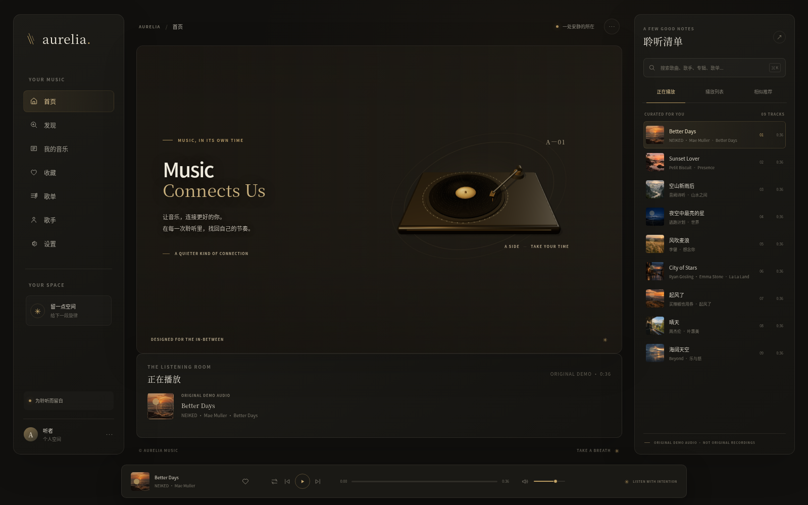

# Aurelia Music

> 一处安静的聆听之所 —— 灵感来自高端音响、黑胶唱片与现代音乐 App 的网页音乐播放器。

Aurelia 是一个纯前端音乐播放器演示项目：用 [Three.js](https://threejs.org) 还原一台带凹槽黑胶、中心标签、唱臂与唱针的黑胶唱机，配合 Web Audio 实时频谱、可搜索曲目队列、收藏与播放模式等完整交互。所有曲目为 36 秒原创试听片段，封面为程序生成的暖色艺术图。

## 界面预览



桌面端聆听界面：包含 3D 黑胶唱机、曲目队列与底部播放控制。

---

## ✨ 特性

- 🎚️ 真实 Three.js 黑胶唱机：凹槽唱片、中心标签、转盘、唱臂、唱头、软光与阴影
- 🎵 9 首原创 36 秒试听片段（MP3），程序生成的曲目封面
- 📊 Web Audio 频谱可视化：56 段暖金色环形频谱，随真实音频律动、暂停时回落
- ▶️ 播放 / 暂停、上一首 / 下一首、进度拖动与键盘 seeking、音量 / 静音
- 🔁 列表循环 / 单曲循环 / 随机播放，自动连播
- ❤️ 收藏状态按曲目持久化到 `localStorage`
- 🖼️ 桌面三栏 / 平板 / 手机 / 小屏响应式布局
- ♿️ 键盘可达、aria 标注、尊重 `prefers-reduced-motion`

---

## 🚀 快速开始（无需安装任何依赖）

> 本项目已将 Three.js 预构建为本地经典脚本，因此 **双击 `index.html` 即可直接运行**，无需 Node.js、npm 或任何打包步骤，也不依赖任何 CDN 或网络。

1. 下载或克隆本仓库。
2. 在文件管理器中 **双击根目录的 `index.html`**，用现代浏览器（Chrome / Edge / Firefox）打开即可。

由于浏览器自动播放策略，首次需点击黑胶唱片或播放按钮后才会出声。

> ⚠️ 频谱可视化限制：本地直接打开（`file://`）时音频可正常播放，但**实时频谱可视化不可用**——Web Audio 无法在 `file://` 下读取本地音频的频谱数据（媒体源会被视为跨域而静音）。如需 56 段环形频谱，请用 `npm run dev` 通过 HTTP 访问。

> 为什么能双击即运行？见下文 [🧠 技术说明](#-技术说明为什么能双击即运行)。

---

## 🛠️ 开发模式（可选）

如需二次开发，仍可使用 Vite 开发服务器：

```bash
npm install
npm run dev      # 启动 http://localhost:4173
npm test         # 运行项目自检（scripts/check-project.mjs）
npm run build    # 生产构建
```

---

## 🔄 重建本地 Three.js 构建（升级 three 时）

`vendor/three.js` 是由 esbuild 将 `three`（core + WebGL）与 `RoundedBoxGeometry` 插件打包成的单个**经典脚本**，运行时把完整命名空间挂在 `window.THREE`。该文件已提交到仓库，普通使用无需重建。仅在升级 three 版本时执行：

```bash
npm install three esbuild --no-save
npm run vendor     # 即 node scripts/build-vendor.mjs
```

---

## 📁 项目结构

```
Aurelia-Music/
├─ index.html              # 入口（双击即可运行）
├─ app.js                  # 播放器主逻辑（经典脚本）
├─ styles.css              # 样式
├─ src/
│  └─ vinyl-stage.js       # Three.js 黑胶唱机场景（经典脚本）
├─ vendor/
│  └─ three.js             # 预构建的全局 Three.js（含 RoundedBoxGeometry）
├─ public/
│  ├─ audio/*.mp3          # 9 首原创试听片段
│  └─ images/              # 封面与场景参考图
├─ scripts/
│  ├─ check-project.mjs    # 项目自检
│  ├─ build-vendor.mjs     # 重建 vendor/three.js 的脚本
│  ├─ vendor-entry.mjs     # vendoring 打包入口
│  └─ generate_demo_audio.py
└─ package.json
```

---

## 🧠 技术说明：为什么能双击即运行？

现代浏览器在 `file://` 协议下，会因 CORS 策略**拦截所有「外部 ES 模块」的加载**——即 `<script type="module" src="./app.js">` 无法再 `import` 本地文件（`file://` 来源为 `null`，不满足模块的 CORS 要求）。但**经典脚本 `<script src>`、CSS、图片、音频在 `file://` 下都能正常加载**。

据此，本项目做了三点改造，使其在不安装任何依赖的情况下双击即运行：

1. **Three.js 本地全局化**：用 esbuild 把 `three`（core + WebGL renderer）与 `RoundedBoxGeometry` 插件打包成单个经典脚本 `vendor/three.js`，运行时把完整命名空间挂在 `window.THREE`（含 `THREE.RoundedBoxGeometry`）。three@0.186 已不再提供 UMD / 全局构建，故需自行打包。
2. **源码改为经典脚本**：`app.js`、`src/vinyl-stage.js` 不再使用 `import / export`，改用 `window.THREE` 全局与全局函数；三者以 `defer` 按序加载（`three` → `vinyl-stage` → `app`），既保留在 `<head>` 中、又保证 DOM 解析完成后再执行。
3. **资源路径自适应**：曲目数据中的 `/audio`、`/images` 是为 Vite 开发服务器（`public/` 挂在站点根）准备的原路径；在 `file://` 下它们会错误地指向文件系统根。`app.js` 在运行时检测 `location.protocol === 'file:'`，自动给这些路径加上 `./public` 前缀，使其指向本地 `public/` 目录；在开发服务器下则保持原样。

`index.html` 中不出现任何 `http://` / `https://`，全部为本地相对路径；`scripts/check-project.mjs` 的全部断言（含“不加载远程运行时资源”）仍通过。

> 关于音频：`file://` 下音频经 `<audio>` 正常播放；但 Web Audio 的 `MediaElementSource` 会把 `file://` 媒体视为跨域而输出静音，因此 `app.js` 在 `file://` 下主动跳过 analyser、保留正常音频输出。56 段环形频谱需在 HTTP（`npm run dev`）下才生效。

---

## 📜 版本历史

### V1.0 — 稳定版

- 完成聆听室视觉系统、响应式布局、黑胶场景、播放控制、封面 / 收藏交互与 reduced-motion 行为的整体收尾。
- 新增紧凑、持久化的列表循环、单曲循环与随机播放模式；自动连播跟随所选模式。
- 生产构建、回归检查、音频 / 可视化交互、空闲渲染行为与小屏布局均已验证。

### V0.9 — 性能与稳定性

- Three.js 场景按需渲染；播放、频谱回落、标签淡入、resize 与指针静止仅保留所需帧。静止的暂停场景停止调度帧。
- 隐藏标签页挂起渲染，可见时干净恢复。
- 场景拆卸移除事件监听并逐一释放共享的几何体、材质与纹理；Web Audio 图保持单例，可视化固定 56 段。

### V0.8 — 迷你播放器与细节

- 停靠的迷你播放器展示当前封面、曲目、艺术家、播放状态与收藏心。
- 收藏 / 取消收藏按曲目持久化到本地存储。
- 点击迷你播放器身份会滚动并聚焦到中央「正在播放」面板；音量、静音与恢复控制保留可用。

### V0.7 — 触感交互

- 悬停 3D 场景产生克制的视差；点击 / 点按唱片，或聚焦后按 Enter / Space 可播放或暂停。
- 曲目元数据与封面卡片约 340 ms 交叉淡入淡出；3D 标签在封面间淡入，主图获得极淡的封面色调晕染。
- 按钮包含悬停、按压与可见的键盘聚焦反馈；过渡遵守 reduced-motion 偏好。

### V0.6 — 音乐可视化

- 仅在首次请求播放时创建唯一的 Web Audio context、media-element source 与 analyser；分析不支持时正常音频仍可用。
- 在 3D 唱片周围添加克制的 56 段暖金色环形频谱，由真实音频频率 bin 驱动，暂停时回落。

### V0.5 — 动态播放列表与封面

- 点击队列行切换其试听音频、标题、艺术家、时长与封面并开始播放。
- 曲目专属的生成封面出现在队列、正在播放卡片、迷你播放器与 3D 唱片中心标签。
- 围绕提供的视觉参考，将中央聆听舞台重构为电影感日落房间。
- 当前封面高亮；仅在播放行出现克制的播放指示。

### V0.4 — 音频播放

- 9 首打包的原创 36 秒器乐试听循环（MP3）；示例歌曲 / 艺术家元数据为示意，并非原版商业录音。
- 播放 / 暂停、上一首 / 下一首、结束自动连播、当前 / 总时长、点击 / 拖动 / 键盘 seeking、音量与静音 / 恢复。
- 播放状态同步 3D 唱片旋转。

- 如需重新生成试听音频，在安装 NumPy 与 `ffmpeg` 后运行 `python3 scripts/generate_demo_audio.py`。

### V0.3 — 3D 黑胶唱机

- 真实 Three.js 黑胶场景：带凹槽唱片、中心标签、底座、唱臂、唱头、柔光与阴影。
- 温和的指针视差与用于后续音频同步的旋转状态钩子。
- 打包的本地依赖；无远程运行时资源。

### V0.2 — 高端聆听室界面

- 桌面三栏布局：导航、中央聆听舞台与专属队列。
- 克制的炭灰、暖金与象牙视觉语言。
- 可搜索的示例目录，含播放列表与相似推荐标签。
- 响应式平板与移动布局。
- 曲目选择与导航反馈（音频播放在 V0.4 引入）。

### V0.1 — 项目地基

- 建立页面区域与响应式视觉地基，暂无播放、搜索、音频分析或交互式 3D。

---

## 📄 许可证

见 [LICENSE](./LICENSE)。
